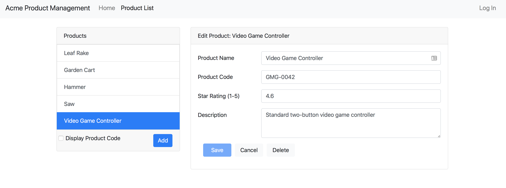

# APM-Product

Starter files with no NgRx added.

## Rxjs Operators used with ngrx effects

**switchMap**: Cancels the current subscription/request and can cause race condition. Use for get requests or cancelable requests like searches

**concatMap**: Runs subscriptions/requests in order and is less performant. Use for get, post and put requests when order is important

**mergeMap**: Runs subscriptions/requests in parallel. Use for put, post and delete methods when order is not important

**exhaustMap**: Ignores all subsequent subscriptions/requests until it completes. Use for login when you do not want more requests until the initial one is complete
